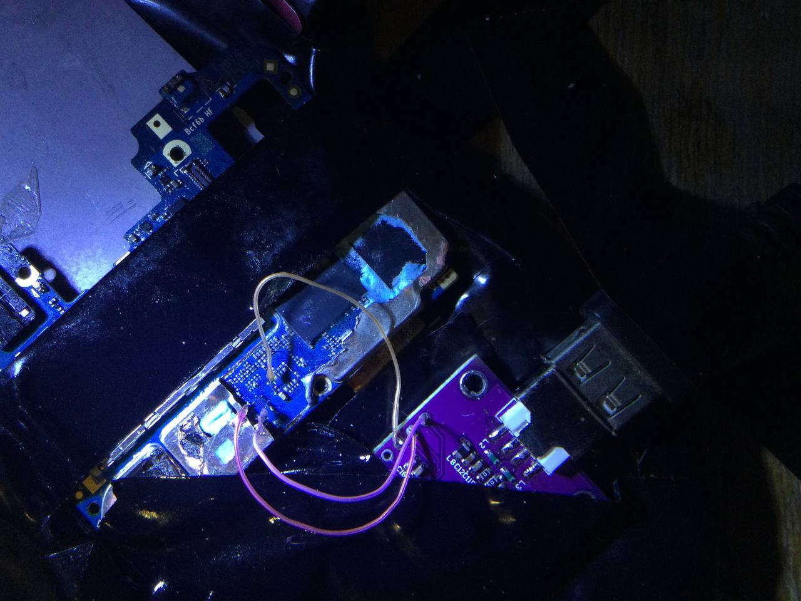

# JTAG
:::warning
Be extremely careful when removing the protective metal shield.

Let's pay tribute to [Roger Ortiz](https://github.com/R0rt1z2), whose phone died during testing.
:::

:::info
The term "JTAG" is usually used to refer to the test points on the board, not the JTAG interface itself.
:::

## Preparing
You'll need special equipment to access and use the required test points. If your goal is to read / write the whole eMMC, your best bet is to use some ISP tool, such as the [Medusa Pro](https://gsmserver.com/item/boxes-and-dongles/medusa-pro-box/), [EasyJTAG](https://easy-jtag.com/), or [Riff Box](https://riffbox.org/).

If you're only interested in flashing / restoring Preloader (A.K.A. `boot1` and `boot2`), you can use FTDI's FT232H board. You can find them for [around $5](https://ftdichip.com/products/ft232hq/).

## Removal of protective metal shield
To access the test points, you'll need to remove the protective metal shield.

There are several ways to do this:
- Laser cutter (Recommended)
- Wire cutters (If you're not rich enough to use a laser cutter)
- ~~Soldering dryer~~ (It is strongly discouraged)

### Laser cutter
| Requirements | Probability of breaking |
|--------------|-------------------------|
| HIGH         | LOW                     |

It's very simple, if you are rich enough and have a laser cutter - cut a square out of the metal screen with it.

### Wire cutters
| Requirements | Probability of breaking |
|--------------|-------------------------|
| LOW          | MEDIUM                  |

If you don't have a laser cutter, a good way to remove the protective metal shield is with wire cutters.

:::warning
If you follow the instructions, you should be fine, just don't overdo it too much and be very careful
:::

1. First, remove all the foil from the back of the board.
    

2. Take wire cutters or tweezers and bend off the edge of the metal shield (which is just above the SOC).
3. Continue to cut away the metal shield, try not to press too hard on the board or SOC and especially avoid dangerous places (marked with red squares).
    
4. If you've made a cut in a metal screen, it's safer to tear it off with pliers (or the same side cutters) rather than trying to cut a square with the side wire cutters.
   
   

## Soldering
The test points **ARE NOT LABELED** and they're **COVERED BY A SOLDER MASK**. You'll have to scrape the solder mask off to expose the test points. They are located on the back of the board, as shown in the image below.

You now have two options, **you can either solder wires to the test points, or you can probes to the test points**. 

### Probes
If you're going to use probes, you'll need to make sure they're making good contact with the test points. You can use a multimeter to check for continuity between the test points and the probes. We personally recommend [Sensepeek's Probes](https://sensepeek.com/4x-sq10-probes-with-test-wires) (they're a bit expensive, but they're worth it).

### Solder wires
If you are going to solder wires, use thin and flexible wires, as the test points are very close together and are only 1mm in size.

It is recommended to solder one side of the wires to the JTAG adapter first, and then solder the other sides of the wires to the test points themselves.

:::note
Feel free to use a small amount of solder acid to tin the pins, but be sure to clean the board with alcohol after work!
:::

:::warning
Be extremely careful! If the wire is too thick or stiff, if you accidentally pull it or solder the connection poorly, there is a high probability that the pins will break off. In most cases, they cannot be repaired.
:::

You'll need to connect the following test points to the FT232H board:

| **Test Point** | **FT232H Pin** |
|----------------|----------------|
| **DAT0**       | AD2            |
| **CMD**        | AD1            |
| **CLK**        | AD0            |
| **GND**        | GND            |

## Reading / Writing
For information regarding any ISP tool, please refer to their respective websites, this section will only cover the FT232H board (for now).

You'll need a machine with Windows to run the software required to read / write the eMMC through the FT232H board.

The program is called `Postal` and you can find it [**here**](https://www.mediafire.com/file/egshro8jznj4dsl/FT232H+++Postal3++++EMMC.rar/file).

Once you've downloaded the software, configure it following the instructions below:
1. Launch the program and make sure configuration gets loaded (see the logs section and look for `Config Load Success`).
2. Click on `Settings` > `COM settings` and make sure `FT232H` is selected under the `Connect via ...` menu. Save the settings.
3. Click on `Settings` > `Other` > `Static` and select `Jtag/SPI`, then make sure `eMMC` is selected under the dropdown menu. Save the settings.
4. Go to `Settings` > `Other` and hit the `Open...` button. Make sure `Force eMMC set` and `Full Size RW` are selected. Save the settings.
4. Go to the main menu and click on `Other` under the `Select Mode` menu. Make sure the `Version` button under `Extra Control` changes to `Set ISP`.

Now, depending on what you want to flash, you'll have to use a specific name for the file you're going to flash. The names are as follows:
- `boot1` = `boot1.bin` (this is the preloader)
- `boot2` = `boot2.bin` (this is the preloader backup?)
- `user` = `user.bin`   (this is the whole eMMC)

Under the `Source File (for flashing)` section, you'll need to select the file you want to flash. In this case, you'll have to repeat the process for each file you want to flash.

Following that, make sure the battery is disconnected from the device, and connect the FT232H board to the device.

Then, grab a wall charger and connect it to the device WHILE YOU SHORT `CMD` (e.g. by using a tweezer to touch the `CMD` test point or its probe to any metal part of the device). This will force the device not to initialize the eMMC, allowing you to read / write it.

Finally, click on `Write` and wait for the process to finish. If you're reading the eMMC, you'll need to click on `Read` instead and the software will save the file to the same directory as the program.

## Troubleshooting
If you get errors while trying to read `EXT_CSD` that means you're not supplying enough power to the device. Make sure you're using a wall charger and not a USB port from your computer.

If you get errors while trying to read / write the eMMC, make sure the test points are making good contact with the probes / wires. You can use a multimeter to check for continuity between the test points and the probes / wires.