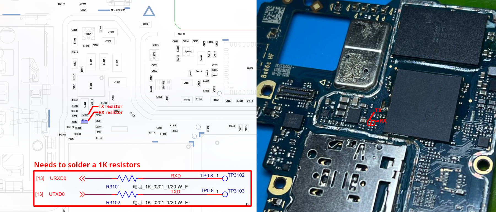
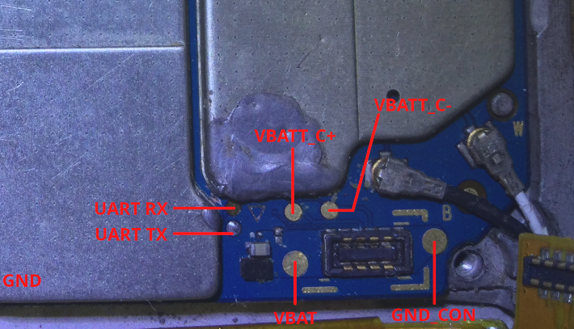

# UART
:::warning
Be extremely careful when removing the protective metal shield.

Let's pay tribute to [Roger Ortiz](https://github.com/R0rt1z2), whose phone died during testing.
:::

## Preparing
On Motorola's production devices, access to UART has been intentionally restricted as part of "perceived security" measures. 

To enable UART, it is necessary to remove the protective metal shield and solder 1K resistors to the UART lines to restore the functionality of the test points.

## Testpoints
