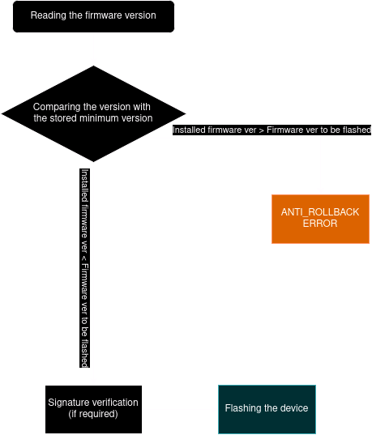
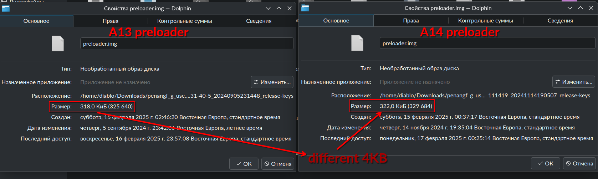
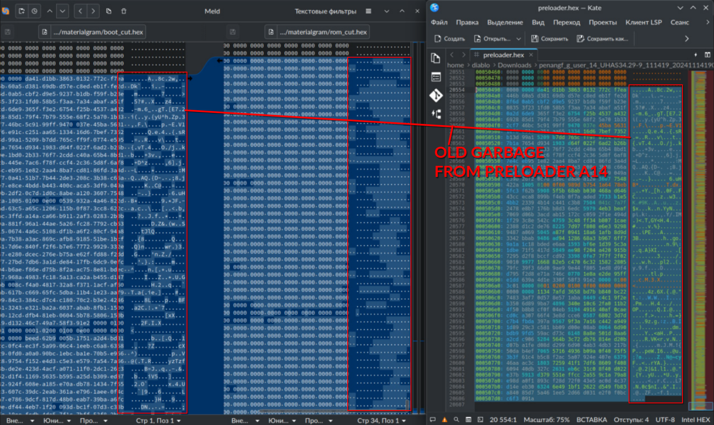

import sticker4 from "@site/static/assets/sticker4.png"
import sticker5 from "@site/static/assets/sticker5.jpg"

## ANTI_ROLLBACK
ANTI_ROLLBACK protection is activated in our device.
Is a mechanism used in devices to prevent the installation of older firmware versions that may be vulnerable or insecure. It checks the firmware version before installing it.

You can rollback to an earlier firmware version only if you have [unlocked bootloader](../dev/bootloader.md)

P.S. There is also an [incident where it was possible to rollback the device via RSA](https://youtu.be/OQetN5hAZoU?si=9-W1bdUpbhkLX1VT) when the firmware version has not yet been updated in another region.



## Rollback A14 => A14
Rollback to the same version of android, but earlier build is possible and the risks of getting hard brick are close to zero, it is quite a safe operation.

1. Download your firmware archive from [lolinet](https://mirrors.lolinet.com/firmware/lenomola/2023/penangf/official/)
2. Clone the [fuckyoumoto](https://github.com/moto-penangf/fuckyoumoto) repository
3. Unpack the firmware archive and run the ```flash_stock.sh``` script with the argument
   ```
   $ ./flash_stock.sh <firmware_directory>
   ```

## Rollback A14 => A13
:::warning
There is a high probability to get a Hard Brick, which can be restored only via [JTAG](../dev/jtag.md)

Do this only if you know what you are doing and if you have all the equipment to restore the phone via [JTAG](../dev/jtag.md)
:::

The problem is that A14 had the boot partition split into boot and vendor_boot partitions.

Also, worst and most dangerous of all, the preloader was heavily modified

### Failed attempts
#### Rollback without flashing preloader
It will not be enough for you to rollback the firmware according to the above instructions (A14 => A14), you will get a bootloop

##### UART Logs
````shell
[10093] mblock_reserve-R[20].start: 0x78000000, size: 0x1600000 map:1 name:ap_md_c_smem
[10096] [cmdline clear] clear str size=31
[10097] g_cmdline size: 1426
[10098] cmdline: console=tty0 console=ttyS0,921600n1 root=/dev/ram vmalloc=400M slub_debug=OFZPU swiotlb=noforce cgroup.memory=nosocket,nokmem f
[10101]        : irmware_class.path=/vendor/firmware page_owner=on loop.max_part=7 has_battery_removed=0 loop.max_part=7 androidboot.boot_device
[10104]        : s=bootdevice,soc/11230000.mmc,11230000.mmc,soc/11230000.msdc,11230000.msdc androidboot.securefuse=on androidboot.secureAttKey=A
[10106]        : A androidboot.secureDrmKey=AA androidboot.ApNvState=0 androidboot.PayJoyImei=NS androidboot.hri_sd=0C81B80A5D2ED0817659FD96EBA2
[10109]        : 31AB94CA01478024B83383D90BFF3FCAEC47 androidboot.lcm=icnl9916_hdp_dsi_vdo_tm ramoops.mem_address=0x4d010000 ramoops.mem_size=0x
[10112]        : e0000 ramoops.pmsg_size=0x10000 ramoops.console_size=0x40000 bootopt=64S3,32N2,64N2 buildvariant=user root=/dev/ram  androidboo
[10115]        : t.slot_suffix=_a androidboot.slot=a androidboot.verifiedbootstate=orange androidboot.atm=disabled androidboot.hardware.sku=XT23
[10117]        : 31-2 androidboot.ramsize=4 androidboot.boardid=16 androidboot.hardware.revision=PVT androidboot.channelmodelname=reteu androidb
[10120]        : oot.odmcarrier= androidboot.targetproduct=penangf_gen androidvendor.manufacturedate=2023 androidboot.force_normal_boot=1 androi
[10123]        : dboot.meta_log_disable=0 androidboot.product.vendor.sku=SKUA mtk_printk_ctrl.disable_uart=0 androidboot.serialno=xxxxxxxxxx and
[10125]        : roidboot.battid=SB18D69209 androidboot.factorymode=0 androidboot.bootreason=kernel_panic gpt=1 usb2jtag_mode=0 androidboot.dtb_
[10128]        : idx=0 androidboot.dtbo_idx=16
[10129] lk boot mode = 0
[10130] lk boot reason = 4
[10130] lk finished --> jump to linux kernel 64Bit

[10131] 
[LK]jump to K64 0x40080000
INFO:    [ATF](0)[17.659776]clear_all_on_mux
INFO:    [ATF](0)[17.660272]SPM: enable CPC mode
INFO:    [ATF](0)[17.660810]save kernel info
INFO:    [ATF](0)[17.661305]bl31_prepare_kernel_entry: return to GZ!
INFO:    [ATF](0)[17.662059]el3_exit
````

#### Rollback, including preloader
:::warning
We're warning you again! There is a high probability to get Hard Brick by flashing the preloader **and you will not be able to repair it without special equipment**
:::

The last of the experiments resulted in a hard brick that was recovered using [JTAG](../dev/jtag.md)


#### UART Logs
````shell
F0: 102B 0000
F3: 0000 0000 [0200]
V0: 8012 0000 [0001]
00: 1017 0000
F3: 4002 0000 [0200]
01: 102A 0001
02: 0007 8000
03: 4002 0000
BP: 0800 0288 [0001]
EC: 0000 0000 [0000]
CC: 0000 0000 [0005]
T0: 0000 00B4 [000F]
System halt!
````

#### The theory of why we got Hard Brick
:::note
Further testing is required, information will be updated after testing
:::

preloader a14 differs from preloader a13 in size by only 4KB. And maybe it was enough to call System Halt.



The problem would have been less significant if mtkclient had correctly flashed a smaller preloader and filled the remaining space after the image with zeros.

But damn it, it's not working the way it's supposed to.

##### Comparing dump and preloader file


We did a dump of the preloader via JTAG, cut the place where there should be only zeros (the last address where the bytes should be located is ```000507d0```)

And compared them once again.

And maybe that's the problem, because **we found garbage from the old preloader a14!** (those bytes that were not overwritten).



##### Possible solution
We should try [flashing the full preloader dump](https://github.com/moto-penangf/dumps/releases) (which is 4MB in size) and it will definitely overwrite the entire partition and leave no garbage like it does with the official image.

#### Flashing preloader full dump (4MB)
After attempting to flash a complete preloader A13 dump, the result is Hard brick, which needs to be restored again via [JTAG](../dev/jtag.md).

I still don't understand how it determines the preloader version (Maybe RPMB???), but unfortunately it does. ***Rollback impossible.***