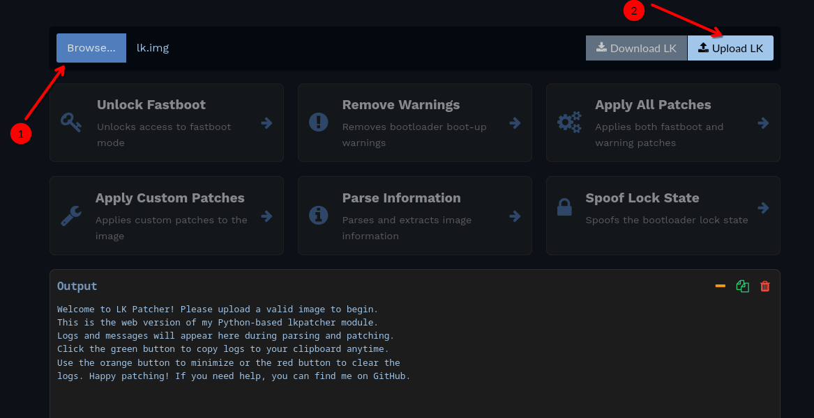
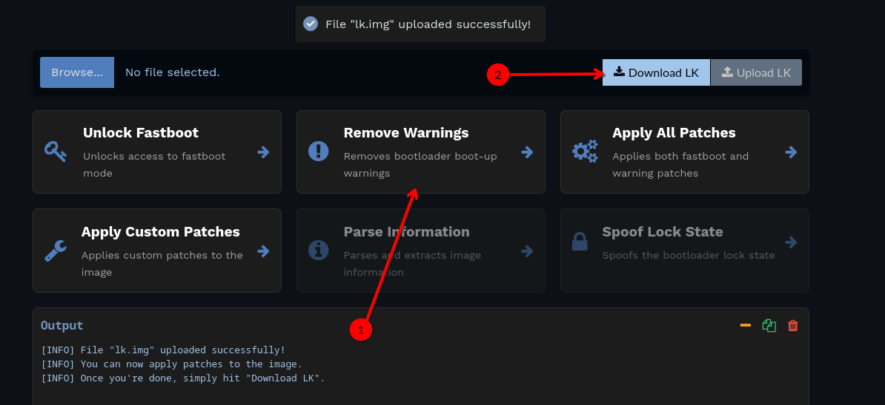

:::warning
Make sure you have the [bootloader unlocked](../dev/bootloader.md) or you will get [soft brick](../info/softbrick.md)!
:::

:::info
Instead of this method you can use a [custom bootloader chouchou](./custom-bootloader.mdx), it has more functionality and also disables Orange State
:::

To remove the "Orange State" warning and other warnings during phone boot, you need to patch the LK for your firmware version using the [LKPatcher utility](https://lkpatcher.r0rt1z2.com/).

## Guide
1. Download your current firmware archive from [lolinet](https://mirrors.lolinet.com/firmware/lenomola/2023/penangf/official/)
2. Unpack the firmware archive and patch the ```lk.img ``` file using the [LKPatcher utility](https://lkpatcher.r0rt1z2.com/)

    
    

3. Flash the ```lk-patched.img``` via fastboot
    ```shell
    $ fastboot flash lk lk-patched.img
    ```