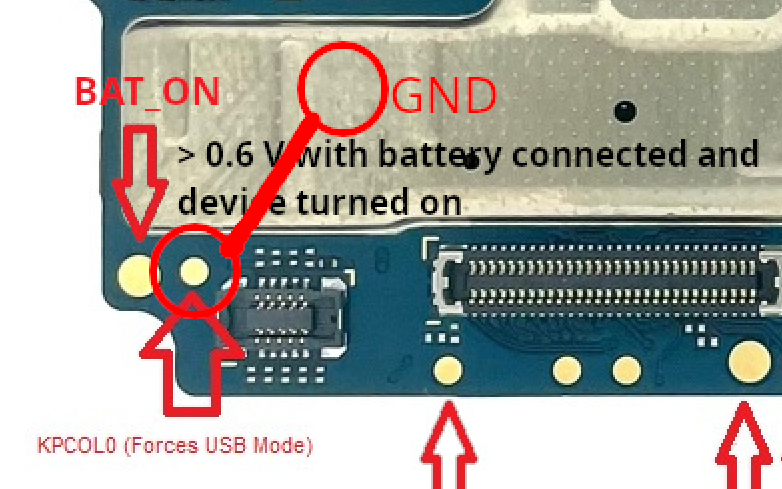

import Tabs from '@theme/Tabs';
import TabItem from '@theme/TabItem';

import menuImg from '@site/static/assets/fastboot/menu.JPG';
import startedImg from '@site/static/assets/fastboot/started.JPG';
import switchConsoleImg from '@site/static/assets/fastboot/switch_console.JPG';
import logsImg from '@site/static/assets/fastboot/logs.JPG';


## Screenshots

<Tabs>
    <TabItem value="0" label="Main menu" default>
        
    </TabItem>
    <TabItem value="1" label="Start / Factory / BpTools modes">
        
    </TabItem>
    <TabItem value="2" label="Switch console">
        
    </TabItem>
    <TabItem value="3" label="Bootloader logs">
        
    </TabItem>
</Tabs>

## Boot to Fastboot mode
There are many ways to boot into Fastboot mode, you can use one of the last complicated ways if for some reason you can't boot into Fastboot.

### Using ADB command
- Enable USB debugging
- Connect the phone to PC, run ```adb devices``` command and confirm USB debugging if you have not connected the phone to the current PC via adb before
- Run the command via adb to reboot into fastboot
    ```sh
    adb reboot bootloader
    ```

### Using VOL- & POWER button
- Power off phone
- **Hold down the VOL- & POWER buttons** and wait for fastboot mode to load

### Using VOL- button & USB connection
- Power off phone
- **Hold down the VOL- button and connect the phone to the PC** and wait for fastboot to load

### Using Serial Command in Preloader Mode
- Power off phone
- Install MTK driver _(If you have Windows)_ - [See tools](../dev/tools.md)
- Clone [fuckyoumoto repository](https://github.com/moto-penangf/fuckyoumoto)
- Install dependencies
    ```shell
    pip install -r requirements.txt
    ```
- Run ``mtkbootcmd.py`` script
    ```shell
    python mtkbootcmd.py FASTBOOT
    ```
- Connect the phone to PC (It should be detected as Preloader)

### Using KPCOL0 TestPoint
- Power off phone
- Short the testpoint KPCOL to GND
- Hold down the shorted testpoint, connect the phone to the PC



## Available commands and mode for fastboot:

### Access fastbootd:
To access fastbootd, you can run `adb reboot fastboot` while the device is booted normally.

:::warning
DO NOT reboot to fastbootd from fastboot, as it may cause a dm-verity error due to a glitch.
:::

:::warning
DO NOT USE "fastboot reboot fastboot" to reboot into fastbootd, you will get a soft brick!
:::

### Available commands

```sh
fastboot getvar all
fastboot flashing get_unlock_ability
fastboot flashing unlock
fastboot reboot
fastboot oem key <KEY> # Feeds the key for bootloader unlocking
fastboot oem get_key # Returns the first part of the soc id. Used in bootloader unlocking
fastboot oem get_socid # Returns the unique id of the SoC
fastboot oem p2u <on/off> # enabled or disables UART logging
fastboot oem dump_pllk_log # dumps preloader and lk logs
fastboot oem lks # Return the lockstate (1 -> locked, 0 -> unlocked)
fastboot oem scp_status # Crashes fastboot
fastboot oem scp_log_thru_ap_uart <on/off> # Redirects SCP (I don't know what it is) to UART
fastboot oem usb2jtag <1/0> # I think it allows to use a modded usb cable as a JTAG?
```

:::info
On the moto g23 and g13, `fastboot flashing unlock_critical` doesn't exist, and instead treats `_critical` as the buffer for
`fastboot flashing unlock`, making the phone freeze
:::
