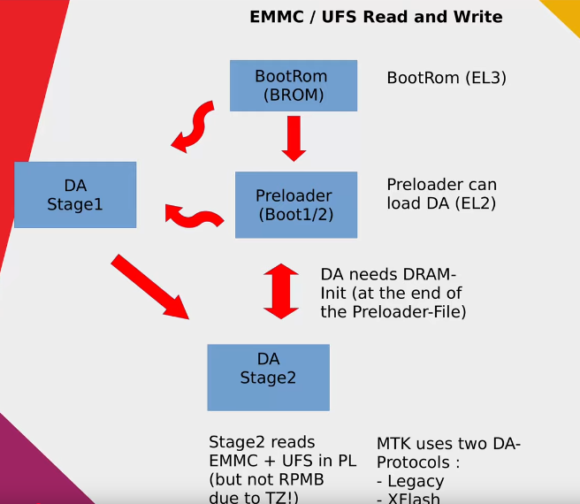

MTK Preloader **is a low-level mode activated after the BROM (Boot ROM)** load on MediaTek devices.

It plays a crucial role in the initial boot process, performing several key functions:
- **Hardware Initialization:** The preloader configures critical device components, such as the processor, memory, and ports.
- **Establishing Connection with External Tools:** Via USB, the preloader interacts with programs like SP Flash Tool, enabling the flashing or recovery of the device firmware.
- **Preparation for Bootloader or OS Loading:** After completing the initial tasks, the preloader hands over control to the main bootloader or the operating system.

The Preloader is essential for the flashing process, as without it, the device’s firmware cannot be updated or recovered.

## Boot to Preloader mode
If the Preloader has not been damaged, **it will automatically start when the device is connected to a PC** with the phone disconnected. 

Once connected, **Preloader will wait a few seconds to receive a command or request from an external tool**, e.g. via SP Flash Tool or similar software tool.

If no requests are received within the set timeout, the Preloader **will terminate and the control will move to the next stage of the boot process**, e.g. the main bootloader or the device's operating system.

## Download Agent (DA)
Preloader expects to receive a special DA file, which defines what actions it is allowed to perform.

Unfortunately, modifying the DA file does not grant more rights or access than what is specified in the original configuration, due to the signature check during loading.

This limitation protects the device from unauthorized modifications and ensures the security of the process, which, unfortunately, significantly limits our capabilities and causes issues in this case. :(

## MtkClient
You can find information about trying with mtkclient [here](../dev/mtkclient.md)